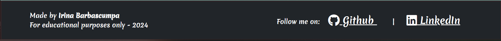
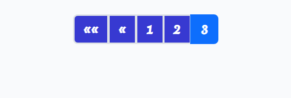

# Taste of Juice

**Taste of Juice** is a full-stack web application designed to revolutionize your juicing experience.
This platform allows users to discover, create, and share delicious juice recipes, promoting health
and well-being through fresh, natural ingredients.

### [Link to Live Website](https://taste-of-juice-pp4-4cc0435c4efc.herokuapp.com/)

---
# Table of Contents

1. [Taste of Juice](#taste-of-juice)
2. [Link to Live Website](#link-to-live-website)
3. [Site & User Goals](#site--user-goals)
   - [Site Goals](#site-goals)
   - [User Goals](#user-goals)
4. [User Experience Design](#user-experience-design)
   - [Site Goals](#site-goals-1)
   - [Agile Planning](#agile-planning)
5. [The Strategy Plane](#the-strategy-plane)
   - [Site Goals](#site-goals-2)
   - [Agile Planning](#agile-planning-1)
6. [The Structure Plane](#the-structure-plane)
   - [Features](#features)
   - [Existing Features](#existing-features)
7. [The Skeleton Plane](#the-skeleton-plane)
   - [Information Architecture](#1-information-architecture)
   - [Content Structure](#2-content-structure)
   - [Navigation Design](#3-navigation-design)
   - [Wireframes](#4-wireframes)
   - [Development Framework](#5-development-framework)
   - [Database Design](#database-design)
   - [Typography](#typography)
   - [Images](#images)
8. [Tools and Technologies](#tools-and-technologies)
9. [Testing](#testing)
   - [Responsiveness](#responsiveness)
   - [Lighthouse](#lighthouse)
   - [Validator Testing](#validator-testing)
   - [HTML Validation](#html-validation)
   - [CSS Validation](#css-validation)
   - [JavaScript Validation](#javascript-validation)
   - [Python Validation](#python-validation)
   - [Manual Testing](#manual-testing)
   - [Automated Testing](#automated-testing)
10. [Bugs](#bugs)
    - [Unfixed Bugs](#unfixed-bugs)
11. [Deployment](#deployment)
    - [Version Control](#version-control)
    - [Deployment in Heroku](#deployment-in-heroku)
    - [Cloning the Repository](#cloning-the-repository)
    - [Forking](#forking)
12. [Credits](#credits)
13. [Acknowledgements](#acknowledgements)

## Site & User Goals

This section outlines the primary goals for the "Taste of Juice" website and its users. The site is designed to facilitate the sharing, discovery, and interaction around juice recipes, providing a user-friendly platform for enthusiasts to connect and share their culinary creations.

## Site Goals

### Recipe Sharing

- **Objective**: Provide a platform where users can create, edit, and share juice with an interested community.
- **Details**:
  - Users should be able to easily input their recipes, including ingredients, instructions, and images.
  - Recipes can be edited or updated by the author at any time.
  - Users can browse and view recipes submitted by others.

### Recipe Categorization

- **Objective**: Ensure a structured category system that allows users to find and organize recipes by Category (e.g., Herbal Juices,Citric Juices, Detox Juices, etc.).

- **Details**:
  - Implement a category system for recipes.
  - Allow users to filter and search recipes based on categories and interactive search.

### Social Interaction

- **Objective**: Enable users to comment and provide feedback on recipes, fostering an active and engaged community.
- **Details**:
  - Allow users to leave comments and ratings on recipes.
  - Implement a notification system to inform users of interactions on their recipes.
  - Create a community section where users can discuss and share ideas.

### User Account Management

- **Objective**: Offer features for users to manage their accounts, including profile updates, tracking their own recipes, and managing interactions.
- **Details**:
  - Users should be able to register, log in, and manage their profiles.
  - Each user can view and manage their submitted recipes.
  - Users can track their interactions, such as comments and feedback received.

### Mobile Responsiveness

- **Objective**: Ensure the site is fully responsive and accessible on various devices, providing a seamless user experience across desktops, tablets, and smartphones.
- **Details**:
  - Implement a mobile-first design approach.
  - Ensure all features are fully functional on mobile devices.
  - Optimize loading times and usability for smaller screens.

## User Goals

### Discover and Explore Recipes

- **Objective**: Easily browse and search for a variety of juice recipes.
- **Details**:
  - Users can explore a vast collection of recipes organized by categories.
  - Implement a search function to find specific recipes or ingredients.

### Create and Share Personal Recipes

- **Objective**: Allow users to submit their own recipes, complete with ingredients, instructions, and images.
- **Details**:
  - Provide a user-friendly form for recipe submission.
  - Allow users to upload images and customize their recipe pages.
  - Enable users to edit and update their recipes as needed.

### Interact with Other Users

- **Objective**: Enable users to comment other users' recipes, facilitating interaction within the community.
- **Details**:
  - Users can leave comments.

### Access Site on Multiple Devices

- **Objective**: Ensure that users can access and use the site seamlessly across different devices, including desktops, tablets, and smartphones.
- **Details**:
  - The site should be fully responsive, providing a consistent experience across devices.
  - Implement touch-friendly interfaces for mobile users.
  - Optimize the site for quick loading times and minimal data usage on mobile networks.

## User Experience Design

- **Site Goals**:

  - Targeted at juice lovers and food enthusiasts.
  - Promote health through the use of natural ingredients.
  - Provide a vibrant, engaging platform for sharing culinary experiences.

- **Agile Planning**:
  - User stories were managed using a GitHub project board.
  - Features were prioritized using the MoSCoW method:
    - **Must Have**: Essential features like user authentication, recipe CRUD operations.
    - **Should Have**: Features like recipe search, pagination, and comments.
    - **Could Have**: Additional enhancements like advanced search options, social media logins.
    - **Won't Have**: Features considered for future implementation if time permits.

## The Strategy Plane

### Site Goals

The website is aimed for everyone who loves Juices and exploring cuisines from all around the globe. The site also aims at people who are simply searching for an inspiration on days when they simply want to try something new and discover a diverse recipes. The application aims to provide a vibrant and engaging platform for food enthusiasts to explore, share and indulge in culinary delights.

### Agile Planning

I employed the Agile methodology and utilized a GitHub project board to organize and develop my user stories starting from the project planning stage and continuing until the final product was built. To enhance clarity and structure, a user story template is designed that precisely outlines each user story with an acceptance criteria to be fulfilled.

- All User Stories include:
  - Acceptance Criteria
  - Labels (MoSCoW Prioritization)
- Labels have been used to mark which features the project : 'must have', 'should have', 'could have'. The prioritization was done so that a MVP for the project is created in time I have and only focus on the 'should haves' or 'could haves' if the time allows.
- Each User story was checked for the acceptance criteria have been met and closed.

- The detailed Project Board with all user stories can be found here. [PROJECT BOARD-link](https://github.com/users/irka775/projects/8)

Project Board

#### Issues

- **1 - Initial Project Setup:**
  The first task in starting the project was to setup it up. All the tasks from setting up github repository to installing django, setting up django app and related packages . The acceptance criteria was refined for each of the setup to be completed for clarity and ease of understanding.

- **2 - User Authentication:**
  This milestone covers user authentication and authorization i.e. user login and logout so that user can explore complete features and functionality of the website.

- **3 - Recipe Post Functions:**
  All the CRUD functionality and features related to recipes,comments is included here.

- **4 - User Interface Design (UX/UI):**
  The website to be user-friendly and responsive on all devices, this milestone covers the styling aspects of the site, from website pagination to responsiveness and error pages so that user has smooth experience throughout the application.

- **5 - Admin Functionality:**
  Includes admin dashboard functionality so that admin can monitor the website for users, recipes and comments. This milestone was included to keep the admin and site user functionality separate for clarity.

- **6 - Final Project Deployment:**
  Included as it was absolutely necessary and important to have a live link of fully functional website with no errors so that everyone can have access to the application.

## The Structure Plane

### Features

### Existing Features

#### Navigation Menu and Footer Section

-As a developer I can create a navigation menu and footer section so that users can easily navigate through site pages and social media links on footer section.

##### Navigation bar for all users (desktop/mobile)

##### Navigation bar for only authorised users (desktop/mobile)

- The NAVIGATION BAR is shown on all pages based on the users logged-in(authentication) status and is responsive to all screen sizes. For smaller screen sizes the navigation bar appears as a hamburger menu and can be easily accessed. A success message is displayed when user is logged-in/ registered.
- The design is kept clean and simple so that user can navigate between the pages easily without any confusion. The links are visible clearly both on large screen and smaller screen sizes.
- The active link is marked for ease of accessibility so that the user knows the current page been visited.
- The navigation menu includes:
  - Home Page - for all users
  - Recipes - for all users
  - Add Juice - for autorized users
  - Sign up Page - for unauthorised user's registration
  - Sign in Page - for users already registered
  - Logout Page - for authorised users
  - About - for all users
- The FOOTER SECTION includes the information about the website: the developer of the website, the purpose (for educational purpose only), year developed and the developer's GitHub and LinkedIn links.
- Similar to the navigation bar, the footer is displayed on every page of the website. It displays icon links to GitHub and LinkedIn accounts. These icon links can enable user to see more about my work through GitHub and learn more about me through LinkedIn. Both the links opens in new page.

#### Home Page

- As a developer, I need to create a home page so that the user can quickly understand what the recipe blog offers and navigate easily to find interesting recipes.

##### Home Page

- The home page is designed such that it is inviting and conveys the user a clear message about the website and what the user can expect throughout the site journey. The background image showcases the essence of the recipe website. User is encouraged to sign up and explore through a quick, simple introduction about the recipe application.

#### Sign-Up / Sign-In / Logout Pages

- As a developer I can settup allauth so that users will have capability to register ans sign in to website.

- All the pages are accessible from navigation bar for large and small screen sizes.
- User can easily access the sign-up / sign-in options to explore the website features completely.
- A clear message is displayed on the pages for user to know whether he needs to sign-in or sign-up to explore the recipe website and to like, comment and post the recipes.
- A success message is displayed to user based on his actions for sign-in, sign-up and sign-out.

#### Add Juice Page and Edit Page

-As a logged in user I can create and edit recipe so that I can share my recipe with others and edit the recipe details if necessary.

- CRUD Functionality - The Add Juice page link is only visible and accessible to logged-in users. On clicking the Add Juice link, authorised users are directed to the create recipe form. The form field marked as //\* are mandatory to be filled. If user tries to submit the form without entering all required field, messages are displayed below relevant fields that are left empty.
- A default image is incorporated so that if the user is unable to provide any recipe image, the default image will act as one.
- All the fields in the form except the Recipe Image field are required. The form is not deemed to be valid in case any of the fields are left empty.
- Users can share their recipes with others using the add recipe form. On submitting the recipe, user is displayed with a success message and directed to that Recipe detail page.

- CRUD Functionality - the feature of edit in recipe details page is only visible and accessible to the logged-in users and only if the user is the author of the recipe.
- On clicking the edit button user is directed to the Edit recipe form/page where user can update / edit recipe for any changes and can either save as draft or publish it. On successful update of the recipe, user is displayed with success message and directed to Recipes Page.

#### Delete Recipe

- As a logged in user I can delete my recipe post so that they are not will appear on the site.

- CRUD Functionality - the feature of delete in recipe details page is only visible and accessible to the logged-in users and only if the user is the author of the recipe.
- User is directed to confirm delete page where user can either delete the recipe or cancel.
- The recipe is permanently deleted if delete is confirmed and a success message is diplayed to user else user will be taken back to recipe details page if cancelled.

#### Recipe Details

-As a site user I can view and read recipes created by other users so that I will enjoy a website.

- User can view a detailed recipe on this page along with number of comments, number of likes and the all recipe information.
- The edit and delete buttons are visible and accessible only to the logged-in user as author of the recipe.
- Logged-in users can explore the recipe details page completely for like / unlike and comments feature.
- If user is not logged-in, information is displayed below recipe for sign-in along with the comments from other users in the comment section.

#### Recipe Pagination (Recipes Page)

- As a site user I can view a pagination list of recipe posts so that I can select recipe.

- This feature allows recipes to be paginated by 6 recipes per page, given more than 2 pages the next and prev buttons appear adjacent to each other.
- On clicking the View Recipe button user is taken to recipe details page to view complete recipe information.

#### Search Recipes Page

- As a Site User, I can search recipes so that I can only view recipes I am interested in.

NOTE----- I did not include that in my user story, I have been created that after to make more interactive my websait. From the start did not been expected to be in a project.

- The search recipes page allows users to search recipes by title, keyword . This page is accessible throughout the website and to all users.
  .

#### Comment Section

-As a site user I can leave a comment for recipe post so that I can cooperate with oters users.

-As a site user I can view comments on a recipe post so that I can read the conversation.

- This feature allows user to comment on recipes posted by others.
- If the user is not logged-in, user will only be displayed with the comments made by others on the recipes and a message to login to comment and like the recipe with sign-in link.
- Authorised users are displayed with the comment box to comment on the recipe, upon comment submission a success message is displayed .
- The comments from other users on the recipe and total number of comments on the recipe is visible to all users regardless of their login status.

#### Admin Functionality

- As a developer, I need to create a superuser so that I can manage the website efficiently and ensure the quality and organization of content on the website.

- The admin can ensure the quality and organization of the content on the webite.
- When the comment is made by any user on the recipe, the comment awaiting approval message is displayed to user. The comment is only displayed if it approved by admin.

#### Feedback on user actions

- As a Site User, I can get corresponding feedback after taking an action so that I know whether my actions were successfully run or not. this is some of them:

- This feature informs the user if the action taken has been successful so that user can know the outcome of every action throughout while navigating the website.

#### Create filter categories feature

- This feature is not included in user story. Hovever this feature is designed to improve user experience by enabling users to quickly find the content that is most relevant to their interests.

- The "Filter Categories" feature allows users to easily narrow down content by selecting one or more categories from a list. This helps users quickly find the specific content they're interested in by dynamically updating the displayed results based on their selected filters. Users can also clear all filters to reset the view to show all available content. The feature is designed to be responsive, user-friendly, and accessible across all devices.

#### Initial Project Setup / Project Documentation / Final Project Deployment

All the user stories are completed for project setup, project documentation and final project deployment

- As a software developer I can set up the juice blog project with all configurations and components so that I can ensure a good development and deployment process of this project.
- As a developer I can create a base.html file so that will have initial structure of page for a project.
- As a developer I can add static files and media so that a website will look user friendly,fascinating and interesting.Will be responsive to all screen sizes.
- As a developer I can create readme.md file so that project will be documented in details.
- As a developer I can be sure the project is deployed to heroku so that everything works and looks good.

### Features left to implement

- Allow users to create and manage personal profiles where they can save their favorite juices, track their tasting history, and set preferences for juice recommendations.
- Implement a feature that enables users to rate and review different juices. This can help other users discover popular options and make informed choices.
- Introduce a feature that suggests juice pairings with meals, snacks, or other drinks, providing a curated experience for users.
- Offer a curated selection of seasonal juices, highlighting the best options for each time of year. This feature can keep the content fresh and relevant for users.
- Implement a subscription model where users can receive monthly deliveries of curated juices based on their taste preferences. This can be a great way to build recurring revenue.

## The Skeleton Plane

The Skeleton Plane outlines the basic structure of the "Taste of Juice" project. This phase focuses on defining the core framework that will guide the development and ensure consistency across all stages. Below are the key elements that make up the Skeleton Plane:

### 1. **Information Architecture**

The project's information architecture is designed to organize content logically and intuitively. This structure ensures that users can easily find and interact with the information they need.

- **Home page**: Provides an frendly image and welcome message with calling to sign_UP .
- **Recipes Page**: List of individual juices, including title,author and option for delete and edit juice recipe information
- **Add Juice Page**: List of forms to create Juice Recipe.
- **About Page**: Messaje for user and calling to collaborate.

- **Register Page**: Register form for create new user.
- **Login Page**: Form for login with Remember me check box.

### 2. **Content Structure**

Content is broken down into key sections that support user goals and business objectives. Each section is designed to provide value, whether through informative text, appealing visuals, or interactive elements.

- **Juice Descriptions**: Detailed information on each juice.

### 3. **Navigation Design**

The navigation system is designed to be intuitive and accessible, ensuring users can easily move through the site.

- **Primary Navigation**: Links to main sections such as Home, Recipes, Add Juice, About,Register, and login depend if user is login or not.
- **Footer**: Contains additional navigation links, social media icons, and legal information.

### 4. **Wireframes**

Wireframes serve as blueprints for the site, mapping out the layout and functionality of each page before design elements are applied.

- **Homepage Wireframe**: Outlines the main sections, including the header, featured juices, and footer.
- **Product Page Wireframe**: Details the layout for individual product pages, focusing on content hierarchy and user interaction.

### 5. **Development Framework**

The project's development framework sets the foundation for coding and building the site.

- **Frontend**: Utilizes HTML, CSS, and JavaScript to create responsive, interactive user interfaces.
- **Backend**: Powered by [Backend Technology], handling data management, user authentication, and other server-side processes.
- **Database**: Structured to efficiently store product information, user data, and transaction records.

### Database Design

- The database ER diagram was designed using [Graphviz](https://graphviz.org/). The main Recipe model contains all the fields needed for the recipe to be complete. Additional fields (like category...) can be added to further enhance the website.
- The diagram shows relationships between the Recipe model, Comments model and others models in project:

  1. **User to Recipe:** One-to-Many (1:M)
     - Each user can create multiple recipes.
     - Each recipe is created by one user.
  2. **Recipe to Comment:** One-to-Many (1:M)
     - Each recipe can have multiple comments.
     - Each comment is associated with one recipe.
  3. **User to Comment:** One-to-Many (1:M)
     - Each user can make multiple comments.
     - Each comment is made by one user.

- In summary, a User can create multiple recipes, and each recipe is associated with one user. A Recipe can have multiple comments, and each comment is associated with one recipe. A User can make multiple comments, and each comment is made by one user.
- These relationships were implemented using `ForeignKey` fields in the models. The Recipe model has a `ForeignKey` field referencing the User model to represent the creator of the recipe, and the Comment model has `ForeignKey` fields referencing both the Recipe model and the User model to represent the recipe being commented on and the user making the comment, respectively.

#### Typography

- [Merienda One](https://fonts.googleapis.com/css?family=Merienda+One|Open+Sans&display=swap)

#### Images

- The images in this project are sourced from [Pixabay](https://pixabay.com/). They were specifically selected to correlate with the main purpose of the website and to give user a imagery representation for the recipe content to increase impact of the design.

### Tools and Technologies

For the development of this project, a variety of tools and technologies were used to ensure efficiency and reliability. Below is a list of the key components:

- **Django**: A high-level Python web framework that allows for rapid development of secure and maintainable websites. In this project, Django serves as the backbone, handling everything from database interactions to user authentication.

  - Version: 4.2.9

- **Django Summernote**: A simple WYSIWYG editor that provides rich text editing capabilities in Django admin. It was used to enhance the admin interface, making content management more user-friendly.

  - Version: 0.8.20.0

- **PostgreSQL**: A powerful, open-source object-relational database system. It is used as the primary database for storing all data related to recipes, users, and comments.

  - Python adapter: `psycopg2-binary` version 2.9.9

- **Cloudinary**: A cloud service that offers a solution to a web application's image management needs. Cloudinary was used to handle image uploads and storage in this project.

  - Version: 1.36.0

- **Gunicorn**: A Python WSGI HTTP Server for UNIX that served as the production server for deploying the Django application.

  - Version: 20.1.0

- **Whitenoise**: A tool for serving static files, which simplifies the process of serving static assets directly from your application without needing a separate server.

  - Version: 5.3.0

- **Pre-commit Hooks**: Tools like `black`, `flake8`, and `isort` were integrated using pre-commit hooks to ensure code consistency and quality before changes were committed to the repository.

  - `black` version: 24.4.2
  - `flake8` version: 7.1.0
  - `isort` version: 5.13.2

- **Graphviz**: Used for generating entity-relationship diagrams (ERD) that visually represent the database structure, making it easier to understand the relationships between different models.

  - Python library: `pydotplus` version 2.0.2

- **Environment Management**: Python environment management was handled using `virtualenv` and `django-environ` to keep development environments isolated and manage environment variables securely.

  - `virtualenv` version: 20.26.2
  - `django-environ` version: 0.11.2

- **Frontend**: The frontend was built using HTML, CSS, and JavaScript, with Bootstrap providing responsive design and layout enhancements.

- **AJAX**: Asynchronous JavaScript and XML (AJAX) was used to enhance the user experience, allowing for dynamic content updates without reloading the entire page.

These tools and technologies together provide a robust foundation for the project, ensuring scalability, maintainability, and a smooth user experience.

## Testing

### Responsiveness

- The site is designed to be flexible, fluid and responsive on all screen sizes. Website has been checked for responsiveness through Chrome Development tools. In order to do this, the following steps have been taken:

  1. Open the browser.
  2. Navigate to the Taste juice website <https://taste-of-juice-pp4-4cc0435c4efc.herokuapp.com/>
  3. Right click anywhere on the page and got to "Inspect" to open Development Tools.
  4. Click on drop down menu: "Dimensions: Responsive" and choose "Responsive".
  5. Drag the side of the screen and change screen size, making sure the website looks good from 300px and up. Here, ensure there is consistency in design of the website on every screen size from small(mobile devices) to larger(desktop devices) and no scorll bar is showing for layout of site.

- Expected Result: Each page is responsive and user friendly when viewing the website on small and large screens.The pages have no design or accessibility issue in any of the screen sizes from 300px and up.
- Actual Result: Website is responsive with no scroll bar showing, the content is accessible to user to read and the images are not appearing stretched. Website is user friendly on small to large screen sizes.

- The following devices are used to check responsiveness:

  - Iphone 12 Pro
  - Samsung Galaxy S20 Ultra
  - iPad Mini
  - Iphone XR
  - Ipod mini

- The following browsers have been used to check responsiveness. Testing for different browsers was carried on using [BrowserStack](https://www.browserstack.com/) and manually on some of the browsers.
  - Chrome
  - Microsoft Edge

### Lighthouse

### Home Page (Desktop / Mobile)

  
Home Page - Desktop

    

  

## Validator Testing

### HTML Validation

All pages have been run through the [W3C VALIDATOR](https://validator.w3.org/).

In order to check HTML code in dynamic website:

- go to the live page
- click right and select 'Inspect' then click right and select 'View page source'
- code will open in new tab - copy the code
- paste the code in the validator as 'direct input'

#### Test First HTML shows eror

#### Test afer fixed the bugs

### CSS Validation

No errors were found when passing through the official Jigsaw W3 Validator

### JavaScript Validation

No errors were found when passing through the [jshint validator](https://jshint.com/)

### Python Validation

Some errors were found when passing file through [CI Python Linter](https://pep8ci.herokuapp.com/)

After fixing errors were found when passing file through [CI Python Linter](https://pep8ci.herokuapp.com/)

## Manual Testing

### Functional Testing

## Automated Testing

### Unit Testing

No unit testing performed at this stage.

## Bugs

- **Installing both Whitenoise and Cloudinary resulted in conflict for serving static files and as a result, the deployment failed.**

  - **Fix:** The order of apps in `INSTALLED_APPS` in `settings.py` for Cloudinary was incorrect. The apps were reordered correctly, Whitenoise and related static files configuration were removed, and static files are now served through Cloudinary.

- **Duplicate column errors during migration:**

  - **Issue:** Running migrations after making changes to the database schema resulted in `DuplicateColumn` errors.
  - **Fix:** Deleted existing migrations and the database, then recreated them from scratch to ensure consistency.

- **Foreign key constraint violation when loading fixtures:**

  - **Issue:** Loading fixtures with recipes failed due to missing associated users in the `auth_user` table.
  - **Fix:** Created or loaded the required user records before loading the fixtures.

- **About Page content and design need improvement:**

  - **Issue:** The content and design of the About Page do not effectively communicate the purpose and story of the project.
  - **Fix:** Revise the content and improve the design to create a more engaging About Page.

- **Color palette could be more cohesive:**
  - **Issue:** The current color palette lacks visual appeal and consistency.
  - **Fix:** Consider redesigning the color scheme to improve the overall aesthetics of the website.

### Unfixed Bugs

- **Better search:** The search functionality needs improvement to provide more accurate and relevant results.
- **About Page should be better:** The content and design of the About Page need enhancements to better convey the purpose and story of the project.
- **Need to make better color palette:** The current color palette could be improved to create a more visually appealing and cohesive design.

## Deployment

### Version Control

- The website was developed through local vscode.

- Code has been pushed to repository on Github with following git commands:

  - git add . - to add files ready to commit
  - git commit -m "message" - to commit the code to local repository ready to be pushed
  - git push - final command used to push committed code to remote repo on Github

### Deployment In Heroku

- The project has been deployed on Heroku as follows:
  - Use: pip freeze > requirements.txt to add external libraries to deployed app.
  - Create Heroku account
  - In the top right, click 'New'
  - Click 'Create new app'
  - Give your app a name and select your region from drop down
  - Click 'Create new app'
  - Go to 'settings' tab, it's important you do it before deployment
  - Scroll down to 'config vars' section and key:
    - PORT and value: 8000
    - CLOUDINARY_URL: 'API key to your cloudinary account'
    - DATABASE_URL : 'URL from your database account'
    - DEVELOPMENT : 'False'
    - SECRET_KEY: 'Generate your own secret key'
  - Scroll down to 'Buildpacks' section
  - Click 'Add buildpack'
  - Add Python as first dependency and select 'Save changes'
  - Select 'Deploy' tab at the top
  - Select 'Github' from 'Deployment method'
  - type the name of how you called project in Github and click 'search'
  - Scroll down and select manual deployment method
  - You can also use Auto deployment method to allow the project to update every time you push the code.
  - You can now click to view the app ready and running
- For this project I used Manual deployment method to deploy the current state of the branch, every time I pushed the code from vscode.

### Cloning the Repository

1. On Github navigate to the repository
2. Click "Code" drop down menu - a green button shown right above the file list.
3. Copy the URL of the repository using "HTTPS", "SSH" or "Github CLI".
4. Open Git Bash.
5. Change the current working directory to the location where you want the cloned directory.
6. Type "git clone", and then paste the URL copied earlier.
7. Press enter to create local clone. A clone of the repository will now be created.

For more details on how to clone the repository in order to create a copy for own use refer to the site: <https://docs.github.com/en/repositories/creating-and-managing-repositories/cloning-a-repository>

### Forking

1. On Github navigate to the repository.
2. Click "Fork" located towards top right corner on GitHub page.
3. Select "owner" for the forked repository from the dropdown menu under "owner".
4. It will create forked repo under the same name as original by default. But you can type a name in "Repository name" or add a description in "Description" box.
5. Click on "Create fork". A forked repo is created.

- Forking allows you to make any changes without affecting original project. You can send the the suggestions by submitting a pull request. Then the Project Owner can review the pull request before accepting the suggestions and merging them.
- When you have fork to a repository, you don't have access to files locally on your device, for getting
  access you will need to clone the forked repository.
- For more details on how to fork the repo, in order to for example suggest any changes to the project you can visit:<https://docs.github.com/en/get-started/quickstart/fork-a-repo>

## Credits

- All images used on the website are sourced from [Pixabay](https://pixabay.com/)
- All the recipes on this website are sourced from [an unchecked source](#) and are intended for educational and example purposes only. Please ensure that you review and verify these recipes before using them for personal use.

- Code Institute's "I Think Therefore I Blog" walkthrough project was referred throughout during development.
- [Django Documentation](https://docs.djangoproject.com/en/4.2/) helped me in understanding the class based views and search functionality.
- [Recipe Tutorial](https://www.youtube.com/watch?v=ZCPhzoK_bg4&list=PLXuTq6OsqZjbCSfiLNb2f1FOs8viArjWy&index=3) helped me to get started with the files setup and base structure.

- [Readme](https://github.com/gayatrig19/tasty-tales-website-pp4/blob/main/README.md) used for basic readme structure.

## Acknowledgements

- I would like to thank my husband, Mihail Barbascumpa, for his constant support and for reviewing my work actively, getting involved in the discussions for website ideas and design content.
- I am also deeply thankful to cohort facilitator Laura ,tutors, student care... for their help
- I am grateful to the Code Institute's Tutor support for solving all my doubts.
